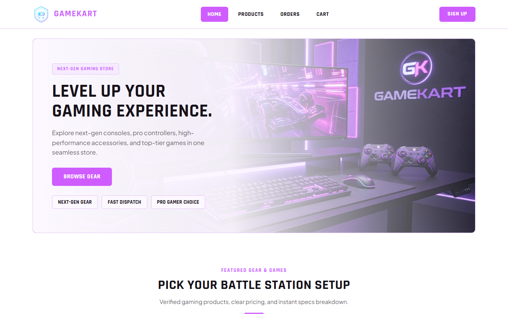
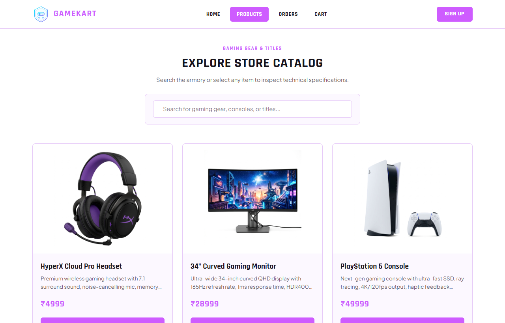
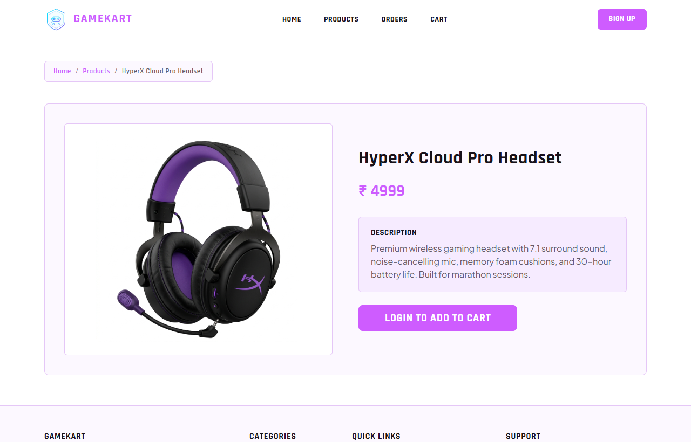
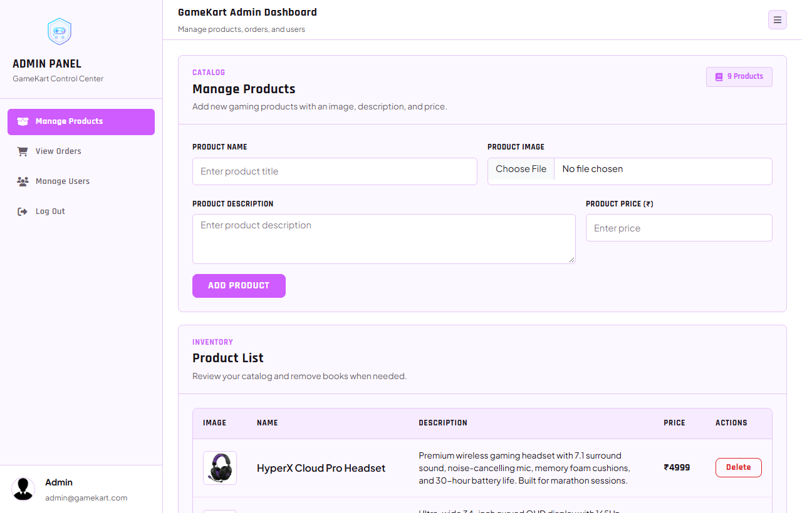
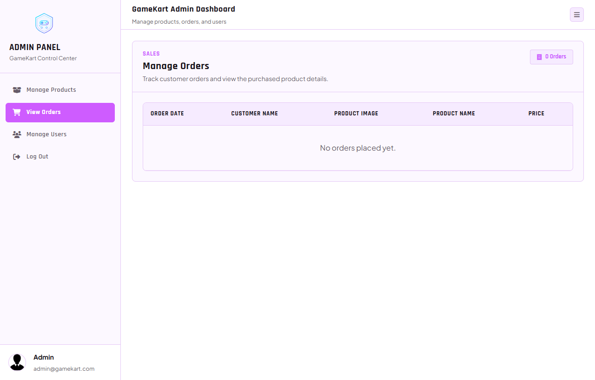
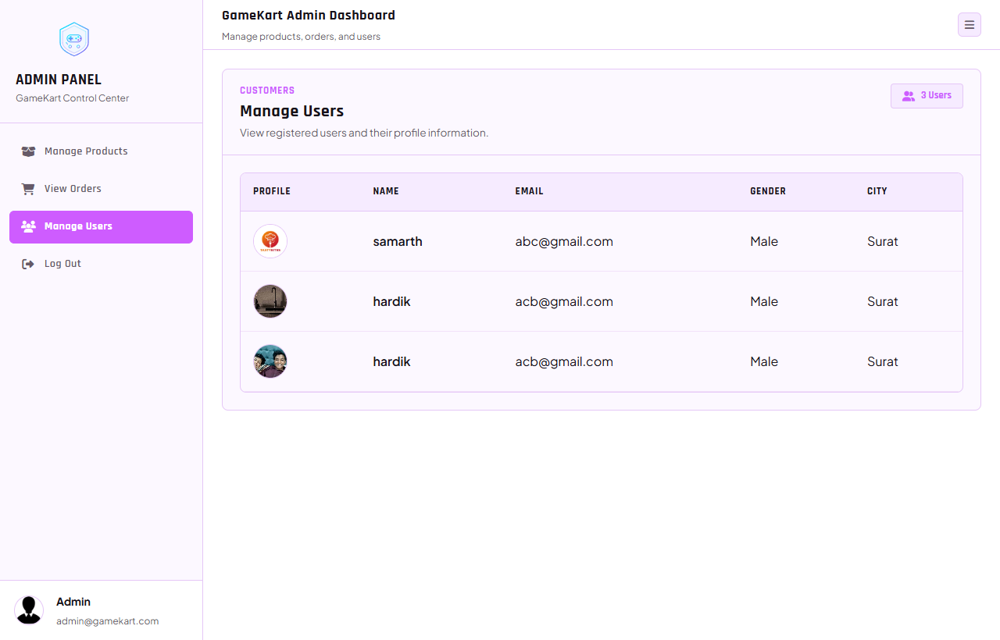

# 🎮 GameKart — Full-Stack E-Commerce & Gaming Gear Platform

<p align="center">
  
</p>

<p align="center">
  <a href="https://github.com/samarth163-cloud/gamekart-awd-project"></a>
  
  
  
  
</p>

---

## 📌 Table of Contents
- [📖 Project Overview](#-project-overview)
- [✨ Key Features](#-key-features)
- [🖼️ Application Preview & Screenshots](#️-application-preview--screenshots)
- [🏛️ System Architecture](#️-system-architecture)
- [🛠️ Tech Stack](#️-tech-stack)
- [🚀 Quick Start Guide](#-quick-start-guide)
- [👤 Demo Credentials](#-demo-credentials)
- [📁 Directory Structure](#-directory-structure)
- [📜 Scripts & Batch Automation](#-scripts--batch-automation)
- [🤝 Contributing & License](#-contributing--license)

---

## 📖 Project Overview

**GameKart** is a modern, high-performance, full-stack e-commerce web platform engineered for gaming merchandise, accessories, gear, and digital books. Designed with a futuristic dark-mode aesthetic featuring neon accents, glassmorphic surfaces, responsive layouts, and interactive UI animations.

The system is separated into two dedicated sub-systems:
1. **Client Portal (`/client`)**: End-user storefront for browsing catalogue items, live search, product inspection, dynamic shopping cart, order placement, order tracking, and user profile management.
2. **Admin Portal (`/admin`)**: Administrative management suite for real-time inventory control (CRUD with image upload), order fulfillment tracking, and registered user analytics.

---

## ✨ Key Features

### 🛒 Customer Storefront (Client)
* **⚡ Cyberpunk & Dark Mode Design**: High-contrast, neon violet/cyan glowing components and fluid hover micro-interactions.
* **🔍 Real-time Search & Filter**: Instant client-side search filtering across product titles and categories.
* **🛍️ Dynamic Shopping Cart**: Seamless cart management with real-time total pricing calculation and order submission.
* **📦 Order Management**: Dedicated user orders dashboard tracking all placed orders with quick cancellation.
* **🔐 Authentication & Profiles**: Registration and login with avatar uploads stored via Multer and persistent sessions.
* **📞 Contact & Support**: Integrated interactive contact form with studio locations and support info.

### 👑 Admin Management Portal
* **📊 Product Inventory CRUD**: Add, edit, inspect, and delete products with image upload support (Multer).
* **📋 Order Management**: Real-time table view of all customer orders, item details, customer info, and total costs.
* **👥 User Accounts Directory**: View registered customer profiles, credentials, cities, and profile images.
* **🔒 Admin Security**: Protected dashboard routes and administrative session controls.

---

## 🖼️ Application Preview & Screenshots

| Storefront Home Page | Product Catalogue & Search |
| :---: | :---: |
|  |  |

| Product Details View | Admin Manage Products |
| :---: | :---: |
|  |  |

| Admin Orders Dashboard | Admin Users Directory |
| :---: | :---: |
|  |  |

---

## 🏛️ System Architecture

```mermaid
graph TD
    subgraph Client ["Client Application"]
        CF[Client UI (React/Vite) - Port 5174]
        CB[Client Express API - Port 4000]
    end

    subgraph Admin ["Admin Application"]
        AF[Admin UI (React/Vite) - Port 5173]
        AB[Admin Express API - Port 5000]
    end

    subgraph Database ["Persistence Layer"]
        DB[(MongoDB 'dbProject' - Port 27017)]
    end

    CF -->|HTTP / REST| CB
    AF -->|HTTP / REST| AB
    CB -->|Mongoose ODM| DB
    AB -->|Mongoose ODM| DB
```

### Port Allocation:
| Component | Layer / Framework | Host / Port |
| :--- | :--- | :--- |
| **Database Server** | MongoDB Community 8.x | `mongodb://localhost:27017` (`dbProject`) |
| **Admin Backend** | Node.js / Express 5.x | `http://localhost:5000` |
| **Client Backend** | Node.js / Express 5.x | `http://localhost:4000` |
| **Admin Frontend** | React 18 / Vite | `http://localhost:5173` |
| **Client Frontend** | React 18 / Vite | `http://localhost:5174` |

---

## 🛠️ Tech Stack

* **Frontend**: React 18, Vite, React Router DOM, Axios, Lucide React Icons
* **Styling**: Custom CSS Design System, CSS Variables, Glassmorphism & Cyberpunk Neon UI
* **Backend**: Node.js, Express.js 5.x, Multer (file/image uploads), CORS, Body-Parser
* **Database**: MongoDB & Mongoose ODM
* **Tooling**: Nodemon, ESLint, Git, Windows Batch Automation Scripts

---

## 🚀 Quick Start Guide

### 1. Prerequisites
Ensure you have installed:
* [Node.js](https://nodejs.org/) (v18 or newer)
* [MongoDB Community Server](https://www.mongodb.com/try/download/community) & [MongoDB Compass](https://www.mongodb.com/products/tools/compass)

### 2. Clone Repository
```bash
git clone https://github.com/samarth163-cloud/gamekart-awd-project.git
cd gamekart-awd-project
```

### 3. Install Dependencies
```bash
# Install root, admin, and client packages
npm install
cd admin && npm install
cd ../client && npm install
cd ..
```

### 4. Seed Database (Optional)
Populate initial gaming products and catalogue items:
```bash
node seed-products.cjs
```

### 5. Run the Project
#### Option A: One-Click Launch (Windows)
Double-click [`start_all.bat`](./start_all.bat) or run from terminal:
```cmd
start_all.bat
```
*(To stop all services, run [`stop_all.bat`](./stop_all.bat))*

#### Option B: Manual Execution (4 Terminals)
```bash
# Terminal 1: Admin Backend (Port 5000)
cd admin && npx nodemon src/server.cjs

# Terminal 2: Client Backend (Port 4000)
cd client && npx nodemon src/server.cjs

# Terminal 3: Admin Frontend (Port 5173)
cd admin && npm run dev

# Terminal 4: Client Frontend (Port 5174)
cd client && npm run dev
```

---

## 👤 Demo Credentials

### 👑 Admin Portal (`http://localhost:5173/`)
| Email | Password | Role |
| :--- | :--- | :--- |
| `admin@gamekart.com` | `admin` | Super Administrator |

### 🛒 Customer Store (`http://localhost:5174/login`)
| Email | Password | City |
| :--- | :--- | :--- |
| `abc@gmail.com` | `123` | Surat |

---

## 📁 Directory Structure

```text
gamekart-awd-project/
├── admin/                        # Admin Portal
│   ├── src/
│   │   ├── Component/            # Navbar, Sidebar components
│   │   ├── Pages/                # Product, Orders, Users, Login pages
│   │   ├── uploads/              # Uploaded product & user media
│   │   ├── server.cjs            # Express API for Admin (Port 5000)
│   │   └── theme.css             # Theme design tokens
│   └── package.json
├── client/                       # Customer Storefront
│   ├── src/
│   │   ├── Component/            # Navbar, Footer
│   │   ├── Pages/                # Home, Product, Cart, Orders, Auth, Contact
│   │   ├── uploads/              # Uploaded static assets
│   │   ├── server.cjs            # Express API for Client (Port 4000)
│   │   └── theme.css             # Client cyber UI system
│   └── package.json
├── screenshots/                  # High-res UI documentation screenshots
├── seed-products.cjs             # Database initial seeding script
├── start_all.bat                 # One-click startup automation script
├── stop_all.bat                  # One-click shutdown automation script
├── setup-run.md                  # Detailed local setup manual
├── .gitignore                    # Git exclusions
└── README.md                     # Main documentation
```

---

## 📜 Scripts & Batch Automation

| Script | Purpose |
| :--- | :--- |
| `start_all.bat` | Launches MongoDB check, both Express API servers, and both Vite frontends in separate background console windows |
| `stop_all.bat` | Terminate all running node/vite servers on ports `4000`, `5000`, `5173`, `5174` |
| `node seed-products.cjs` | Inserts verified gaming consoles, mechanical keyboards, mice, and accessories into `dbProject.products` |

---

## 🤝 Contributing & License

Developed as part of the **Advanced Web Development (AWD) Project - TYBCA 2026**.

Feel free to fork, customize, and submit issues or pull requests!